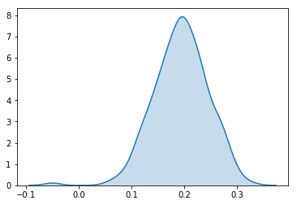
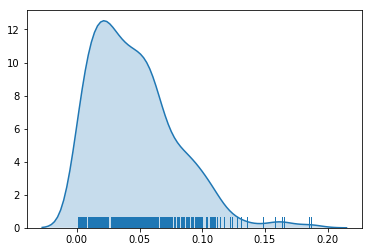
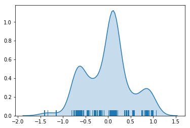
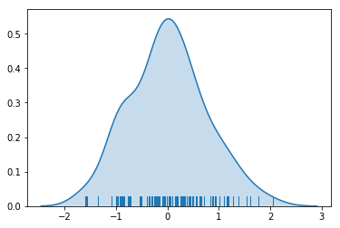
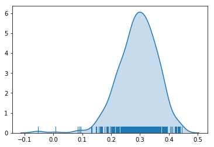
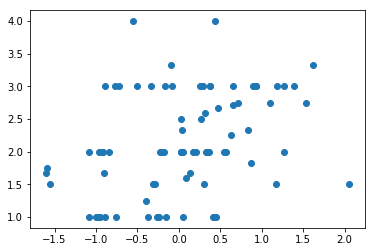
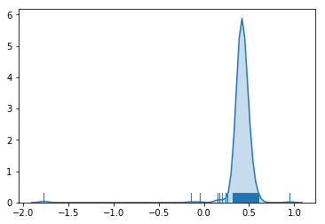

```python
%matplotlib inline

import pymc3 as pm

basic_model = pm.Model()

from scipy import optimize

from matplotlib import pyplot as plt
import numpy as np
import theano.tensor as tt
import scipy.stats as sstats
import json

class IdAssigner:
    def __init__(self):
        self._dict = {}
        self._list = []

    def get_id(self, id_):
        if id_ not in self._dict:
            new_id = len(self._dict)
            self._dict[id_] = new_id
            self._list.append(id_)
        return self._dict[id_]

    def get_without_add(self, id_):
        return self._dict[id_]

    def get_or_none(self, id_):
        return self._dict.get(id_, None)

    def size(self):
        return len(self._list)

def stupid_csv(filename):
    return [
        [eval(x) for x in line.split(',')]
        for line in open(filename).read().split("\n")[:-1]]

def kderug(stuff):
    sb.kdeplot(stuff, shade=True)
    sb.rugplot(stuff)
```


```python


company_interviews_with_initial_ids = stupid_csv('/tmp/company_interviews.csv')

company_id_assigner = IdAssigner()
candidate_id_assigner = IdAssigner()

company_interviews = np.asarray([
    [company_id_assigner.get_id(d[0]), candidate_id_assigner.get_id(d[1]), d[2]]
    for d in company_interviews_with_initial_ids
])

company_ids = company_interviews[:, 0]
candidate_ids = company_interviews[:, 1]
scores = company_interviews[:, 2]

num_people = candidate_id_assigner.size()
num_companies = company_id_assigner.size()

tb_candidate_scores = np.asarray([
    [candidate_id_assigner.get_without_add(d[0]), d[1]]
    for d in stupid_csv('/tmp/tb_candidate_scores.csv')])

tb_interview_candidate_ids = tb_candidate_scores[:, 0]
tb_interview_scores = tb_candidate_scores[:, 1]

tb_matching_model = np.asarray([
    [company_id_assigner.get_id(d[0]), d[1]]
    for d in stupid_csv('/tmp/company_cs_preferences.csv')
    if company_id_assigner.get_or_none(d[0])])
tb_matching_model_dict = { int(x): y for (x, y) in tb_matching_model }
tb_matching_model_company_ids = tb_matching_model[:, 0].astype(np.int32)
tb_matching_model_scores = tb_matching_model[:, 1]

company_names = json.loads(open('/tmp/company_names.json').read())

def company(idx):
    return company_names[str(company_id_assigner._list[idx])]
```


```python
candidate_reports = []

candidate_report_data = json.loads(open('/tmp/candidate_interview_reports.json').read())

for datum in candidate_report_data:
    candidate_id = candidate_id_assigner.get_or_none(datum['candidate_id'])
    company_id = company_id_assigner.get_or_none(datum['company_id'])
    focus = datum['focus']
    level = datum['level']

    if candidate_id and company_id:
        candidate_reports.append((candidate_id, company_id, focus, level))

candidate_reports = np.asarray(candidate_reports)
```


```python
NUM_SAMPLES = 500

with pm.Model() as change_model:
    skill_measurement_sd = pm.HalfNormal('skill_measurement_sd', sd=3)

    skills = pm.Normal('skills', shape=(num_people,))
    co_standard_weight = pm.HalfNormal('co_standard_weight')
    co_standards = pm.Normal('co_standards', shape=(num_companies,))

    score_constant = pm.Normal('score_constant', mu=2.5, sd=10)
    # positive if the candidate is too good
    score_mu = skills[candidate_ids] - co_standards[company_ids] * co_standard_weight + score_constant

    # The first source of data is the algorithm scores provided by the company.
    predicted_scores = pm.Normal('predicted_scores',
                                 mu=score_mu,
                                 sd=skill_measurement_sd,
                                 observed=company_interviews[:,2])


    # The second is the questionnaire
    standards_to_focus_weight = pm.Normal('standards_to_focus_weight')
    true_algo_focus_bias = pm.Normal('true_algo_focus_bias')
    true_algo_focus_sd = pm.HalfNormal('true_algo_focus_sd')
    true_algo_focus_report_sd = pm.HalfNormal('true_algo_focus_report_sd')
    true_algo_focus_mu = co_standards * standards_to_focus_weight + true_algo_focus_bias
    true_algo_focus = pm.Normal('true_algo_focus',
                                shape=(num_companies,),
                                mu=true_algo_focus_mu,
                                sd=true_algo_focus_sd)

    observed_algo_focus = pm.Normal('observed_algo_focus',
                                    mu=true_algo_focus[candidate_reports[:,1]],
                                    sd=true_algo_focus_report_sd,
                                    observed=candidate_reports[:,2])

    # and the level
    standards_to_level_weight = pm.Normal('standards_to_level_weight')
    true_algo_level_bias = pm.Normal('true_algo_level_bias')
    true_algo_level_sd = pm.HalfNormal('true_algo_level_sd')
    true_algo_level_report_sd = pm.HalfNormal('true_algo_level_report_sd')
    true_algo_level_mu = co_standards * standards_to_level_weight + true_algo_level_bias
    true_algo_level = pm.Normal('true_algo_level',
                                shape=(num_companies,),
                                mu=true_algo_level_mu,
                                sd=true_algo_level_sd)

    observed_algo_level = pm.Normal('observed_algo_level',
                                    mu=true_algo_level[candidate_reports[:,1]],
                                    sd=true_algo_level_report_sd,
                                    observed=candidate_reports[:,3])


    start = pm.find_MAP(fmin=optimize.fmin_powell)

    # instantiate sampler
    step = pm.Slice()

    trace_scores = pm.sample(NUM_SAMPLES, tune=200, n_init=2500)

```

    INFO (theano.gof.compilelock): Refreshing lock /Users/buck/.theano/compiledir_Darwin-16.7.0-x86_64-i386-64bit-i386-3.6.1-64/lock_dir/lock
    Auto-assigning NUTS sampler...
    Initializing NUTS using advi...


    Optimization terminated successfully.
             Current function value: -2462.737805
             Iterations: 12
             Function evaluations: 75925


    Average ELBO = -5,324.4: 100%|██████████| 2500/2500 [00:00<00:00, 3158.18it/s]
    Finished [100%]: Average ELBO = -4,592.9
    100%|██████████| 500/500 [13:33<00:00,  1.63s/it]


```python

correlation_between_latent_skill_and_our_interview = np.asarray([
    sstats.pearsonr(trace_scores['skills'][i][tb_interview_candidate_ids], tb_interview_scores)[0]
    for i in range(NUM_SAMPLES)])

```


```python
import seaborn as sb

sb.kdeplot(correlation_between_latent_skill_and_our_interview, shade=True)
```


    <matplotlib.axes._subplots.AxesSubplot at 0x1164a99e8>





```python
# How much does the latent company standards variable affect their interviewing, vs them all being the same?

kderug(trace_scores['co_standard_weight'])
trace_scores['co_standard_weight'].mean()
```


    0.045887387362458072





```python
# How much do candidates vary in skill?
# The multiple modes are an artefact of taking the mean.
kderug(trace_scores['skills'].mean(axis=0))
```





```python
# Who is the best candidate ever at CS? Apparently Paul Rubin

best_candidate_idx = trace_scores['skills'].mean(axis=0).argmax()
print(best_candidate_idx)
print(candidate_id_assigner._list[best_candidate_idx])
print("Here are all the interviews of him:")
print(company_interviews[company_interviews[:, 1] == 198])
```

    198
    54902
    Here are all the interviews of him:
    [[  2 198   4]
     [ 46 198   4]
     [ 15 198   4]
     [ 72 198   4]]


```python
# Who is the worst candidate ever at CS? Apparently Joe Burdick, who got a 1 at Rippling.

worst_candidate_idx = trace_scores['skills'].mean(axis=0).argmin()
print(worst_candidate_idx)
print(candidate_id_assigner._list[worst_candidate_idx])
print("Here are all the interviews of him:")
print(company_interviews[company_interviews[:, 1] == 240])

company(93)
```

    240
    73912
    Here are all the interviews of him:
    [[ 93 240   1]]


    'Rippling'


```python
standards_estimates = trace_scores['co_standards'].mean(axis=0)
kderug(standards_estimates)
```





```python
correlation_between_latent_difficulty_and_our_matching = np.asarray([
    sstats.pearsonr(trace_scores['co_standards'][i][tb_matching_model_company_ids], tb_matching_model_scores)[0]
    for i in range(NUM_SAMPLES)])
kderug(correlation_between_latent_difficulty_and_our_matching)
```





```python
# Probability that our matching criteria is anti-correlated with company algorithm standards
(correlation_between_latent_difficulty_and_our_matching < 0).mean()

# 23% ain't bad
```


    0.0040000000000000001


```python
standard_estimates_vector = standards_estimates[tb_matching_model_company_ids]

plt.scatter(standard_estimates_vector, tb_matching_model_scores)
```


    <matplotlib.collections.PathCollection at 0x1166234e0>





```python
normalized_standards = (standard_estimates_vector - standard_estimates_vector.mean()) / standard_estimates_vector.std()
tmms = tb_matching_model_scores
normalized_model_scores = (tmms - tmms.mean())/tmms.std()
```


```python
error = np.square(normalized_standards - normalized_model_scores)
error_and_company_id = list(reversed(sorted(
    zip(
        error,
        (company(x) for x in tb_matching_model_company_ids),
       (company_id_assigner._list[x] for x in tb_matching_model_company_ids),
#         standard_estimates_vector,
#         tb_matching_model_scores,
        normalized_standards - normalized_model_scores
    ))))

```


```python
# before I add in candidate_reports, this is:

[(9.80963365691819, 2401),
 (7.70795184275363, 2273),
 (6.712834673838651, 1058),
 (6.4483077384329635, 1200),
 (5.355271985679323, 1721),
 (5.286330402669675, 2152),
 (5.20717757794082, 2564),
 (4.690721724057547, 2433),
 (4.445262561776392, 2017),
 (4.31592298442533, 2475)]

# This claims that we should adjust the CS requirements of the company in the direction given at the end
error_and_company_id[:20]
```


    [(11.5505199869809, 'Triplebyte', 1315, 3.3986055945020892),
     (9.8428087766278942, 'Heap', 1058, -3.1373250989701233),
     (5.2294031803179104, 'HeadSpin', 1816, -2.2867888359701931),
     (5.187859887018166, 'Iterable, Inc', 2035, 2.277687398880313),
     (4.5594290952396248, 'Ladder', 2155, -2.1352819708974327),
     (4.269835587496253, 'Open Invest', 1456, -2.0663580492006348),
     (3.9887924575996414, 'SigOpt', 832, 1.9971961490048096),
     (3.7639274998306065, 'ClearMetal', 2122, 1.940084405336687),
     (3.5434751684385621, 'Jane Street', 1731, -1.8824120612763195),
     (3.2068791199491558, 'LightStep', 2380, -1.7907761222300111),
     (3.0724602779625689, 'TapFwd', 2433, 1.7528434835896127),
     (2.8920194226515257, 'OpenAI', 1724, -1.7005938441178499),
     (2.5234199192981013, 'Sense', 2401, -1.5885275947549986),
     (2.4655218142367992, 'Tophatter', 1926, -1.570198017524159),
     (2.2015276470538212, 'Zenysis', 1627, 1.4837545777701315),
     (2.1964586713135796, 'Lattice', 1681, -1.4820454349693803),
     (2.1258398747074789, 'Blend', 1969, 1.4580260199007009),
     (1.8494627202553828, 'Collective Health', 2475, -1.3599495285691241),
     (1.5766441177204318, 'Famous Industries, Inc.', 2279, -1.2556449011246897),
     (1.5648567638434101, 'Common Networks', 1844, -1.250942350327708)]


```python
kderug(trace_scores['standards_to_focus_weight'])
```





```python
num_companies_with_matching_data = tb_matching_model_company_ids.shape[0]
matching_score_coefs = []

for sample_idx in range(NUM_SAMPLES):
    A = np.vstack([
        trace_scores['co_standards'][sample_idx][tb_matching_model_company_ids],
        np.ones(num_companies_with_matching_data)
    ]).T

    m, c = np.linalg.lstsq(A, tb_matching_model_scores)[0]
    matching_score_coefs.append([m, c])

matching_score_coefs = np.asarray(matching_score_linear_functions)

```


```python

def model_claims(company_id):
    idx = company_id_assigner.get_or_none(company_id)

    standards_trace = trace_scores['co_standards']
    recommended_matching_scores = matching_score_coefs[:,0] * standards_trace[:, idx] + matching_score_coefs[:,1]
    mean_recommendation = recommended_matching_scores.mean()

    if idx in tb_matching_model_dict:
        current_matching_model = tb_matching_model_dict[idx]

        if mean_recommendation > current_matching_model:
            proportion_which_agree = (recommended_matching_scores > current_matching_model).mean()
        else:
            proportion_which_agree = (recommended_matching_scores < current_matching_model).mean()
    else:
        current_matching_model = None
        proportion_which_agree = None

    return {
        'current_standards_estimate': standards_trace[:, idx].mean(),
        'p_higher_standards_than_average': (standards_trace[:,idx] > trace_scores['co_standards'].mean(axis=1)).mean(),
        'current_matching_score': current_matching_model,
        'mean_matching_score_recommendation': mean_recommendation,
        'proportion_which_agree': proportion_which_agree,
        'name': company_names[str(company_id)],
        'l1_matching_score_error': (
            abs(mean_recommendation - current_matching_model) if current_matching_model else None
        )
#         'recommended_matching_scores': recommended_matching_scores
        # todo: maybe add squared error back in
    }
```


```python
company_analysis = {cid: model_claims(cid) for cid in company_id_assigner._list}

company_analysis[1058]


```


    {'current_matching_score': 4.0,
     'current_standards_estimate': -0.54875046942965933,
     'l1_matching_score_error': 1.9907727715696089,
     'mean_matching_score_recommendation': 2.0092272284303911,
     'name': 'Heap',
     'p_higher_standards_than_average': 0.124,
     'proportion_which_agree': 1.0}


Suggested model score is:

for every sample, consider the linear relationship between latent standard and TB matching score, and
choose the matching score according to that linear function.


confidence is % of the samples where the computed matching score is different from what we have in the particular direction


```python
sorted([x for x in company_analysis.values() if x.get('l1_matching_score_error')],
       key=lambda x: x['l1_matching_score_error'])
```


    [{'current_matching_score': 2.3333333333333335,
      'current_standards_estimate': 0.83864133517875028,
      'l1_matching_score_error': 0.0066383255130215701,
      'mean_matching_score_recommendation': 2.3266950078203119,
      'name': 'Color Genomics',
      'p_higher_standards_than_average': 0.92200000000000004,
      'proportion_which_agree': 0.54800000000000004},
     {'current_matching_score': 1.75,
      'current_standards_estimate': -1.5866199058310904,
      'l1_matching_score_error': 0.01273689968985714,
      'mean_matching_score_recommendation': 1.7627368996898571,
      'name': 'Tophatter',
      'p_higher_standards_than_average': 0.0080000000000000002,
      'proportion_which_agree': 0.55400000000000005},
     {'current_matching_score': 2.25,
      'current_standards_estimate': 0.62883127608466804,
      'l1_matching_score_error': 0.029713145767640281,
      'mean_matching_score_recommendation': 2.2797131457676403,
      'name': 'Cruise',
      'p_higher_standards_than_average': 0.95199999999999996,
      'proportion_which_agree': 0.62},
     {'current_matching_score': 2.0,
      'current_standards_estimate': -0.84737601808383378,
      'l1_matching_score_error': 0.064670992199723054,
      'mean_matching_score_recommendation': 1.9353290078002769,
      'name': 'Stripe',
      'p_higher_standards_than_average': 0.016,
      'proportion_which_agree': 0.78400000000000003},
     {'current_matching_score': 2.0,
      'current_standards_estimate': -0.23008818121007529,
      'l1_matching_score_error': 0.078545757713013753,
      'mean_matching_score_recommendation': 2.0785457577130138,
      'name': 'Atrium',
      'p_higher_standards_than_average': 0.37,
      'proportion_which_agree': 0.69999999999999996},
     {'current_matching_score': 2.0,
      'current_standards_estimate': -0.92777068417963326,
      'l1_matching_score_error': 0.083221041853735356,
      'mean_matching_score_recommendation': 1.9167789581462646,
      'name': 'Talix Inc.',
      'p_higher_standards_than_average': 0.017999999999999999,
      'proportion_which_agree': 0.77600000000000002},
     {'current_matching_score': 2.0,
      'current_standards_estimate': -0.91930103971312471,
      'l1_matching_score_error': 0.083659225423954098,
      'mean_matching_score_recommendation': 1.9163407745760459,
      'name': 'PersistIQ',
      'p_higher_standards_than_average': 0.108,
      'proportion_which_agree': 0.66400000000000003},
     {'current_matching_score': 2.0,
      'current_standards_estimate': -0.20937072561880224,
      'l1_matching_score_error': 0.086037348134485825,
      'mean_matching_score_recommendation': 2.0860373481344858,
      'name': 'Captain401',
      'p_higher_standards_than_average': 0.34000000000000002,
      'proportion_which_agree': 0.76400000000000001},
     {'current_matching_score': 2.0,
      'current_standards_estimate': -0.18193468098931675,
      'l1_matching_score_error': 0.091005883348651118,
      'mean_matching_score_recommendation': 2.0910058833486511,
      'name': 'Zippy',
      'p_higher_standards_than_average': 0.37,
      'proportion_which_agree': 0.71399999999999997},
     {'current_matching_score': 2.0,
      'current_standards_estimate': -0.96517981536305519,
      'l1_matching_score_error': 0.093526551725793494,
      'mean_matching_score_recommendation': 1.9064734482742065,
      'name': 'Expo',
      'p_higher_standards_than_average': 0.029999999999999999,
      'proportion_which_agree': 0.79800000000000004},
     {'current_matching_score': 1.6666666666666667,
      'current_standards_estimate': -1.6014803141525367,
      'l1_matching_score_error': 0.094411694844692473,
      'mean_matching_score_recommendation': 1.7610783615113592,
      'name': 'Lattice',
      'p_higher_standards_than_average': 0.0040000000000000001,
      'proportion_which_agree': 0.754},
     {'current_matching_score': 2.0,
      'current_standards_estimate': -1.0886267613541596,
      'l1_matching_score_error': 0.11538613240356854,
      'mean_matching_score_recommendation': 1.8846138675964315,
      'name': 'Famous Industries, Inc.',
      'p_higher_standards_than_average': 0.094,
      'proportion_which_agree': 0.748},
     {'current_matching_score': 2.0,
      'current_standards_estimate': 0.025751501817373908,
      'l1_matching_score_error': 0.12996347702016608,
      'mean_matching_score_recommendation': 2.1299634770201661,
      'name': 'American Express',
      'p_higher_standards_than_average': 0.496,
      'proportion_which_agree': 0.73199999999999998},
     {'current_matching_score': 2.0,
      'current_standards_estimate': 0.029464719967530126,
      'l1_matching_score_error': 0.14149788563793653,
      'mean_matching_score_recommendation': 2.1414978856379365,
      'name': 'Point',
      'p_higher_standards_than_average': 0.51800000000000002,
      'proportion_which_agree': 0.85399999999999998},
     {'current_matching_score': 2.0,
      'current_standards_estimate': 0.049954949417185743,
      'l1_matching_score_error': 0.14179787602835425,
      'mean_matching_score_recommendation': 2.1417978760283543,
      'name': 'Chartio',
      'p_higher_standards_than_average': 0.53000000000000003,
      'proportion_which_agree': 0.92400000000000004},
     {'current_matching_score': 2.0,
      'current_standards_estimate': 0.040345275673149973,
      'l1_matching_score_error': 0.14735220675483296,
      'mean_matching_score_recommendation': 2.147352206754833,
      'name': 'Evidation Health',
      'p_higher_standards_than_average': 0.48199999999999998,
      'proportion_which_agree': 0.746},
     {'current_matching_score': 2.0,
      'current_standards_estimate': 0.17303286447457891,
      'l1_matching_score_error': 0.17065076572998317,
      'mean_matching_score_recommendation': 2.1706507657299832,
      'name': 'Benchling',
      'p_higher_standards_than_average': 0.66800000000000004,
      'proportion_which_agree': 0.94199999999999995},
     {'current_matching_score': 2.0,
      'current_standards_estimate': 0.20710815322780246,
      'l1_matching_score_error': 0.1817449884681932,
      'mean_matching_score_recommendation': 2.1817449884681932,
      'name': 'Remix',
      'p_higher_standards_than_average': 0.67600000000000005,
      'proportion_which_agree': 0.94799999999999995},
     {'current_matching_score': 2.3333333333333335,
      'current_standards_estimate': 0.037350823230105475,
      'l1_matching_score_error': 0.19210370637138086,
      'mean_matching_score_recommendation': 2.1412296269619526,
      'name': 'Groupon',
      'p_higher_standards_than_average': 0.51800000000000002,
      'proportion_which_agree': 0.95199999999999996},
     {'current_matching_score': 2.0,
      'current_standards_estimate': 0.32265173680317571,
      'l1_matching_score_error': 0.20803033937022075,
      'mean_matching_score_recommendation': 2.2080303393702208,
      'name': 'Equidate, Inc.',
      'p_higher_standards_than_average': 0.874,
      'proportion_which_agree': 0.998},
     {'current_matching_score': 2.0,
      'current_standards_estimate': 0.33973712275769508,
      'l1_matching_score_error': 0.21209434789826975,
      'mean_matching_score_recommendation': 2.2120943478982698,
      'name': 'Rippling',
      'p_higher_standards_than_average': 0.752,
      'proportion_which_agree': 0.97599999999999998},
     {'current_matching_score': 2.0,
      'current_standards_estimate': 0.36848766719948789,
      'l1_matching_score_error': 0.22066761299613447,
      'mean_matching_score_recommendation': 2.2206676129961345,
      'name': 'Counsyl',
      'p_higher_standards_than_average': 0.66000000000000003,
      'proportion_which_agree': 0.89400000000000002},
     {'current_matching_score': 1.6666666666666667,
      'current_standards_estimate': -0.89963261398904359,
      'l1_matching_score_error': 0.25217396620049137,
      'mean_matching_score_recommendation': 1.9188406328671581,
      'name': 'Marble',
      'p_higher_standards_than_average': 0.114,
      'proportion_which_agree': 0.90600000000000003},
     {'current_matching_score': 2.75,
      'current_standards_estimate': 1.5375303418478761,
      'l1_matching_score_error': 0.25713131218393492,
      'mean_matching_score_recommendation': 2.4928686878160651,
      'name': 'Apple (Siri Team)',
      'p_higher_standards_than_average': 0.98599999999999999,
      'proportion_which_agree': 0.98199999999999998},
     {'current_matching_score': 2.0,
      'current_standards_estimate': 0.54979265703632296,
      'l1_matching_score_error': 0.26001577188471936,
      'mean_matching_score_recommendation': 2.2600157718847194,
      'name': 'Juniper Square',
      'p_higher_standards_than_average': 0.88600000000000001,
      'proportion_which_agree': 0.98599999999999999},
     {'current_matching_score': 2.0,
      'current_standards_estimate': 0.56515863863301075,
      'l1_matching_score_error': 0.26387070189415063,
      'mean_matching_score_recommendation': 2.2638707018941506,
      'name': 'Streak',
      'p_higher_standards_than_average': 0.89400000000000002,
      'proportion_which_agree': 0.99199999999999999},
     {'current_matching_score': 1.5,
      'current_standards_estimate': -1.5610219538353154,
      'l1_matching_score_error': 0.27015595632653588,
      'mean_matching_score_recommendation': 1.7701559563265359,
      'name': 'Numerai',
      'p_higher_standards_than_average': 0.0060000000000000001,
      'proportion_which_agree': 0.98199999999999998},
     {'current_matching_score': 2.5,
      'current_standards_estimate': 0.26202252160292688,
      'l1_matching_score_error': 0.30645975763447986,
      'mean_matching_score_recommendation': 2.1935402423655201,
      'name': 'Tempo Automation',
      'p_higher_standards_than_average': 0.59799999999999998,
      'proportion_which_agree': 0.90200000000000002},
     {'current_matching_score': 2.5,
      'current_standards_estimate': 0.028854915167715652,
      'l1_matching_score_error': 0.36017171577544094,
      'mean_matching_score_recommendation': 2.1398282842245591,
      'name': 'Liftoff',
      'p_higher_standards_than_average': 0.502,
      'proportion_which_agree': 0.998},
     {'current_matching_score': 2.75,
      'current_standards_estimate': 1.1036849373051472,
      'l1_matching_score_error': 0.36086128258430117,
      'mean_matching_score_recommendation': 2.3891387174156988,
      'name': 'Even',
      'p_higher_standards_than_average': 0.996,
      'proportion_which_agree': 0.99399999999999999},
     {'current_matching_score': 2.6000000000000001,
      'current_standards_estimate': 0.31870419379269754,
      'l1_matching_score_error': 0.38831422017462147,
      'mean_matching_score_recommendation': 2.2116857798253786,
      'name': 'Scratch',
      'p_higher_standards_than_average': 0.69799999999999995,
      'proportion_which_agree': 0.998},
     {'current_matching_score': 2.6666666666666665,
      'current_standards_estimate': 0.47419813553002105,
      'l1_matching_score_error': 0.42231910049869903,
      'mean_matching_score_recommendation': 2.2443475661679675,
      'name': 'Gusto',
      'p_higher_standards_than_average': 0.81999999999999995,
      'proportion_which_agree': 0.996},
     {'current_matching_score': 2.7142857142857144,
      'current_standards_estimate': 0.65541790384095566,
      'l1_matching_score_error': 0.4268283467241738,
      'mean_matching_score_recommendation': 2.2874573675615406,
      'name': 'Dropbox',
      'p_higher_standards_than_average': 0.96999999999999997,
      'proportion_which_agree': 1.0},
     {'current_matching_score': 2.0,
      'current_standards_estimate': 1.2672608013951567,
      'l1_matching_score_error': 0.42817900175068235,
      'mean_matching_score_recommendation': 2.4281790017506824,
      'name': 'TapFwd',
      'p_higher_standards_than_average': 0.97799999999999998,
      'proportion_which_agree': 0.998},
     {'current_matching_score': 2.75,
      'current_standards_estimate': 0.71678102978978431,
      'l1_matching_score_error': 0.44524758215394211,
      'mean_matching_score_recommendation': 2.3047524178460579,
      'name': 'Niantic Labs',
      'p_higher_standards_than_average': 0.92000000000000004,
      'proportion_which_agree': 1.0},
     {'current_matching_score': 1.6666666666666667,
      'current_standards_estimate': 0.13950429068110157,
      'l1_matching_score_error': 0.49756101086192328,
      'mean_matching_score_recommendation': 2.16422767752859,
      'name': 'Activehours',
      'p_higher_standards_than_average': 0.63,
      'proportion_which_agree': 1.0},
     {'current_matching_score': 1.8333333333333333,
      'current_standards_estimate': 0.86861320166898026,
      'l1_matching_score_error': 0.50269045769028531,
      'mean_matching_score_recommendation': 2.3360237910236186,
      'name': 'Blend',
      'p_higher_standards_than_average': 0.99199999999999999,
      'proportion_which_agree': 1.0},
     {'current_matching_score': 3.0,
      'current_standards_estimate': 1.384075745988764,
      'l1_matching_score_error': 0.54614992966323461,
      'mean_matching_score_recommendation': 2.4538500703367654,
      'name': 'Liftigniter',
      'p_higher_standards_than_average': 0.99399999999999999,
      'proportion_which_agree': 0.998},
     {'current_matching_score': 1.6000000000000001,
      'current_standards_estimate': 0.090001287869794597,
      'l1_matching_score_error': 0.55606797162164412,
      'mean_matching_score_recommendation': 2.1560679716216442,
      'name': 'Samsara',
      'p_higher_standards_than_average': 0.59599999999999997,
      'proportion_which_agree': 1.0},
     {'current_matching_score': 1.5,
      'current_standards_estimate': -0.31662177219669296,
      'l1_matching_score_error': 0.55642141751451524,
      'mean_matching_score_recommendation': 2.0564214175145152,
      'name': 'Narvar',
      'p_higher_standards_than_average': 0.34000000000000002,
      'proportion_which_agree': 0.998},
     {'current_matching_score': 1.5,
      'current_standards_estimate': -0.29155491249022647,
      'l1_matching_score_error': 0.56488753514758905,
      'mean_matching_score_recommendation': 2.064887535147589,
      'name': 'Zipline',
      'p_higher_standards_than_average': 0.35599999999999998,
      'proportion_which_agree': 0.996},
     {'current_matching_score': 3.0,
      'current_standards_estimate': 1.2682150481478165,
      'l1_matching_score_error': 0.56838789533185441,
      'mean_matching_score_recommendation': 2.4316121046681456,
      'name': 'Pocket Gems',
      'p_higher_standards_than_average': 0.99399999999999999,
      'proportion_which_agree': 1.0},
     {'current_matching_score': 3.0,
      'current_standards_estimate': 1.1834445436965431,
      'l1_matching_score_error': 0.59161316726944824,
      'mean_matching_score_recommendation': 2.4083868327305518,
      'name': 'Mixpanel',
      'p_higher_standards_than_average': 0.99199999999999999,
      'proportion_which_agree': 1.0},
     {'current_matching_score': 3.0,
      'current_standards_estimate': 0.93062146813908453,
      'l1_matching_score_error': 0.6471716675308925,
      'mean_matching_score_recommendation': 2.3528283324691075,
      'name': 'Cardiogram',
      'p_higher_standards_than_average': 0.94199999999999995,
      'proportion_which_agree': 1.0},
     {'current_matching_score': 3.0,
      'current_standards_estimate': 0.9314334934632742,
      'l1_matching_score_error': 0.64876383454800246,
      'mean_matching_score_recommendation': 2.3512361654519975,
      'name': 'Boosted Boards',
      'p_higher_standards_than_average': 0.91200000000000003,
      'proportion_which_agree': 1.0},
     {'current_matching_score': 3.0,
      'current_standards_estimate': 0.88818070558589413,
      'l1_matching_score_error': 0.65543966459361114,
      'mean_matching_score_recommendation': 2.3445603354063889,
      'name': 'Fathom Health',
      'p_higher_standards_than_average': 0.91200000000000003,
      'proportion_which_agree': 0.998},
     {'current_matching_score': 1.5,
      'current_standards_estimate': 0.29879980096863379,
      'l1_matching_score_error': 0.69880831336664251,
      'mean_matching_score_recommendation': 2.1988083133666425,
      'name': 'Chariot',
      'p_higher_standards_than_average': 0.72399999999999998,
      'proportion_which_agree': 1.0},
     {'current_matching_score': 3.0,
      'current_standards_estimate': 0.64795757314160951,
      'l1_matching_score_error': 0.71528092251002162,
      'mean_matching_score_recommendation': 2.2847190774899784,
      'name': 'Scale',
      'p_higher_standards_than_average': 0.94599999999999995,
      'proportion_which_agree': 1.0},
     {'current_matching_score': 3.0,
      'current_standards_estimate': 0.37779053142370833,
      'l1_matching_score_error': 0.77445924901281149,
      'mean_matching_score_recommendation': 2.2255407509871885,
      'name': 'Evernote',
      'p_higher_standards_than_average': 0.69599999999999995,
      'proportion_which_agree': 1.0},
     {'current_matching_score': 3.0,
      'current_standards_estimate': 0.37586174981372455,
      'l1_matching_score_error': 0.77925071699049475,
      'mean_matching_score_recommendation': 2.2207492830095052,
      'name': 'Opendoor',
      'p_higher_standards_than_average': 0.878,
      'proportion_which_agree': 1.0},
     {'current_matching_score': 1.25,
      'current_standards_estimate': -0.40167489870311157,
      'l1_matching_score_error': 0.78754557203396169,
      'mean_matching_score_recommendation': 2.0375455720339617,
      'name': 'Instacart',
      'p_higher_standards_than_average': 0.053999999999999999,
      'proportion_which_agree': 1.0},
     {'current_matching_score': 3.0,
      'current_standards_estimate': 0.29357972349096806,
      'l1_matching_score_error': 0.79452026807036891,
      'mean_matching_score_recommendation': 2.2054797319296311,
      'name': 'Eden',
      'p_higher_standards_than_average': 0.628,
      'proportion_which_agree': 1.0},
     {'current_matching_score': 3.0,
      'current_standards_estimate': 0.25362323347094645,
      'l1_matching_score_error': 0.80422574578306438,
      'mean_matching_score_recommendation': 2.1957742542169356,
      'name': 'Ohmygreen',
      'p_higher_standards_than_average': 0.63400000000000001,
      'proportion_which_agree': 1.0},
     {'current_matching_score': 3.3333333333333335,
      'current_standards_estimate': 1.6157090386958439,
      'l1_matching_score_error': 0.82344110033170059,
      'mean_matching_score_recommendation': 2.5098922330016329,
      'name': 'Asana',
      'p_higher_standards_than_average': 0.99199999999999999,
      'proportion_which_agree': 1.0},
     {'current_matching_score': 1.0,
      'current_standards_estimate': -1.083997627721957,
      'l1_matching_score_error': 0.87761755223830629,
      'mean_matching_score_recommendation': 1.8776175522383063,
      'name': 'PlanGrid',
      'p_higher_standards_than_average': 0.02,
      'proportion_which_agree': 1.0},
     {'current_matching_score': 3.0,
      'current_standards_estimate': -0.078252926877455983,
      'l1_matching_score_error': 0.88444588927131118,
      'mean_matching_score_recommendation': 2.1155541107286888,
      'name': 'Common Networks',
      'p_higher_standards_than_average': 0.39000000000000001,
      'proportion_which_agree': 1.0},
     {'current_matching_score': 1.0,
      'current_standards_estimate': -0.99942852130128201,
      'l1_matching_score_error': 0.89160007375084849,
      'mean_matching_score_recommendation': 1.8916000737508485,
      'name': 'Shopkick',
      'p_higher_standards_than_average': 0.089999999999999997,
      'proportion_which_agree': 1.0},
     {'current_matching_score': 1.0,
      'current_standards_estimate': -0.95922963909588199,
      'l1_matching_score_error': 0.90002252224039392,
      'mean_matching_score_recommendation': 1.9000225222403939,
      'name': 'Veyond',
      'p_higher_standards_than_average': 0.13200000000000001,
      'proportion_which_agree': 1.0},
     {'current_matching_score': 1.5,
      'current_standards_estimate': 1.1749099779228318,
      'l1_matching_score_error': 0.90197966497414717,
      'mean_matching_score_recommendation': 2.4019796649741472,
      'name': 'Iterable, Inc',
      'p_higher_standards_than_average': 0.97199999999999998,
      'proportion_which_agree': 1.0},
     {'current_matching_score': 3.0,
      'current_standards_estimate': -0.16361428535042141,
      'l1_matching_score_error': 0.90211307649969674,
      'mean_matching_score_recommendation': 2.0978869235003033,
      'name': 'Collective Health',
      'p_higher_standards_than_average': 0.39400000000000002,
      'proportion_which_agree': 1.0},
     {'current_matching_score': 1.0,
      'current_standards_estimate': -0.96278008608216803,
      'l1_matching_score_error': 0.90230457676131204,
      'mean_matching_score_recommendation': 1.902304576761312,
      'name': 'NOVA',
      'p_higher_standards_than_average': 0.085999999999999993,
      'proportion_which_agree': 1.0},
     {'current_matching_score': 1.0,
      'current_standards_estimate': -0.9573370091083363,
      'l1_matching_score_error': 0.90641966971393084,
      'mean_matching_score_recommendation': 1.9064196697139308,
      'name': 'Coursera',
      'p_higher_standards_than_average': 0.10000000000000001,
      'proportion_which_agree': 1.0},
     {'current_matching_score': 1.0,
      'current_standards_estimate': -0.88876618193692847,
      'l1_matching_score_error': 0.92256873471020895,
      'mean_matching_score_recommendation': 1.9225687347102089,
      'name': 'b8ta',
      'p_higher_standards_than_average': 0.058000000000000003,
      'proportion_which_agree': 1.0},
     {'current_matching_score': 3.0,
      'current_standards_estimate': -0.34260923377058283,
      'l1_matching_score_error': 0.9433811757128594,
      'mean_matching_score_recommendation': 2.0566188242871406,
      'name': 'Sense',
      'p_higher_standards_than_average': 0.216,
      'proportion_which_agree': 1.0},
     {'current_matching_score': 1.0,
      'current_standards_estimate': -0.75754956524079742,
      'l1_matching_score_error': 0.95266386790323954,
      'mean_matching_score_recommendation': 1.9526638679032395,
      'name': 'BlueData',
      'p_higher_standards_than_average': 0.037999999999999999,
      'proportion_which_agree': 1.0},
     {'current_matching_score': 3.0,
      'current_standards_estimate': -0.5009860428297912,
      'l1_matching_score_error': 0.98048894991888469,
      'mean_matching_score_recommendation': 2.0195110500811153,
      'name': 'LightStep',
      'p_higher_standards_than_average': 0.19600000000000001,
      'proportion_which_agree': 1.0},
     {'current_matching_score': 3.0,
      'current_standards_estimate': -0.71678878202841356,
      'l1_matching_score_error': 1.0337896047439608,
      'mean_matching_score_recommendation': 1.9662103952560392,
      'name': 'Open Invest',
      'p_higher_standards_than_average': 0.085999999999999993,
      'proportion_which_agree': 1.0},
     {'current_matching_score': 1.0,
      'current_standards_estimate': -0.36971464270894006,
      'l1_matching_score_error': 1.0407285506851753,
      'mean_matching_score_recommendation': 2.0407285506851753,
      'name': 'Sourcegraph',
      'p_higher_standards_than_average': 0.23599999999999999,
      'proportion_which_agree': 1.0},
     {'current_matching_score': 3.0,
      'current_standards_estimate': -0.77076173759188082,
      'l1_matching_score_error': 1.0470966008660485,
      'mean_matching_score_recommendation': 1.9529033991339515,
      'name': 'Ladder',
      'p_higher_standards_than_average': 0.13200000000000001,
      'proportion_which_agree': 1.0},
     {'current_matching_score': 1.0,
      'current_standards_estimate': -0.25884998233987144,
      'l1_matching_score_error': 1.0637679417824484,
      'mean_matching_score_recommendation': 2.0637679417824484,
      'name': 'Etleap',
      'p_higher_standards_than_average': 0.36199999999999999,
      'proportion_which_agree': 1.0},
     {'current_matching_score': 1.0,
      'current_standards_estimate': -0.23741114675338865,
      'l1_matching_score_error': 1.0669758611146372,
      'mean_matching_score_recommendation': 2.0669758611146372,
      'name': 'OneSignal',
      'p_higher_standards_than_average': 0.35799999999999998,
      'proportion_which_agree': 1.0},
     {'current_matching_score': 3.0,
      'current_standards_estimate': -0.88940375758756307,
      'l1_matching_score_error': 1.0707167139438825,
      'mean_matching_score_recommendation': 1.9292832860561175,
      'name': 'HeadSpin',
      'p_higher_standards_than_average': 0.059999999999999998,
      'proportion_which_agree': 1.0},
     {'current_matching_score': 1.0,
      'current_standards_estimate': -0.15499630156222066,
      'l1_matching_score_error': 1.0923294838197073,
      'mean_matching_score_recommendation': 2.0923294838197073,
      'name': 'Affinity',
      'p_higher_standards_than_average': 0.30599999999999999,
      'proportion_which_agree': 1.0},
     {'current_matching_score': 1.5,
      'current_standards_estimate': 2.0526787768126851,
      'l1_matching_score_error': 1.1084530937825559,
      'mean_matching_score_recommendation': 2.6084530937825559,
      'name': 'Triplebyte',
      'p_higher_standards_than_average': 0.98999999999999999,
      'proportion_which_agree': 1.0},
     {'current_matching_score': 1.0,
      'current_standards_estimate': 0.0498512579814279,
      'l1_matching_score_error': 1.1194012202885206,
      'mean_matching_score_recommendation': 2.1194012202885206,
      'name': 'Zenysis',
      'p_higher_standards_than_average': 0.51000000000000001,
      'proportion_which_agree': 1.0},
     {'current_matching_score': 3.3333333333333335,
      'current_standards_estimate': -0.094802303393564699,
      'l1_matching_score_error': 1.2132424136656339,
      'mean_matching_score_recommendation': 2.1200909196676996,
      'name': 'OpenAI',
      'p_higher_standards_than_average': 0.45600000000000002,
      'proportion_which_agree': 1.0},
     {'current_matching_score': 1.0,
      'current_standards_estimate': 0.40719409192349076,
      'l1_matching_score_error': 1.213430695769949,
      'mean_matching_score_recommendation': 2.213430695769949,
      'name': 'ClearMetal',
      'p_higher_standards_than_average': 0.68999999999999995,
      'proportion_which_agree': 1.0},
     {'current_matching_score': 1.0,
      'current_standards_estimate': 0.4519171652377435,
      'l1_matching_score_error': 1.2381903879843819,
      'mean_matching_score_recommendation': 2.2381903879843819,
      'name': 'SigOpt',
      'p_higher_standards_than_average': 0.94799999999999995,
      'proportion_which_agree': 1.0},
     {'current_matching_score': 4.0,
      'current_standards_estimate': 0.43394703169948251,
      'l1_matching_score_error': 1.7617911521671767,
      'mean_matching_score_recommendation': 2.2382088478328233,
      'name': 'Jane Street',
      'p_higher_standards_than_average': 0.84199999999999997,
      'proportion_which_agree': 1.0},
     {'current_matching_score': 4.0,
      'current_standards_estimate': -0.54875046942965933,
      'l1_matching_score_error': 1.9907727715696089,
      'mean_matching_score_recommendation': 2.0092272284303911,
      'name': 'Heap',
      'p_higher_standards_than_average': 0.124,
      'proportion_which_agree': 1.0}]


```python

```
